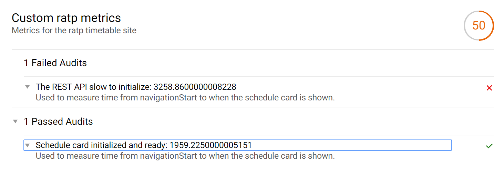
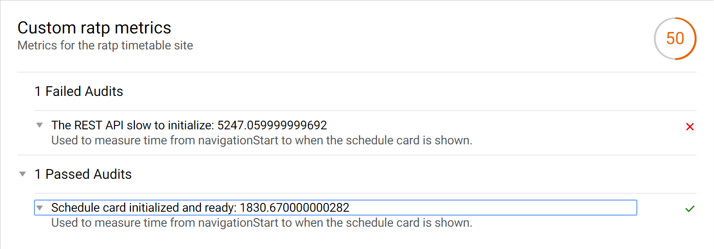
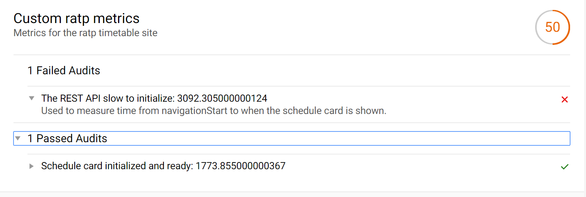
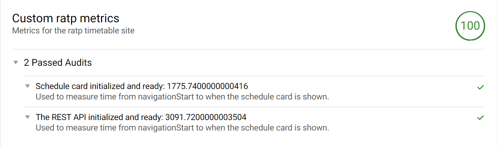

Se configuró el archivo custom-config de ligthhouse para generar las metricas personalizadas.

````$xslt
'use strict';

module.exports = {

    extends: 'lighthouse:default',

    passes: [
        {
            passName: 'defaultPass',
            gatherers: [
                'card-gatherer',
                'api-gatherer'
            ]
        }
    ],

    audits: [
        'card-audit',
        'api-audit'
    ],

    categories: {
        ratp_pwa: {
            name: 'Custom ratp metrics',
            description: 'Metrics for the ratp timetable site',
            audits: [
                {id: 'card-audit', weight: 1},
                {id: 'api-audit', weight: 1}
            ]
        }
    }
};
````

### Prueba 1:

### Prueba 2:

### Prueba 3:

### Prueba 4:


Los tiempos de respuesta de los servicios son variables por lo tanto las pruebas fallan en algunas ocaciones.